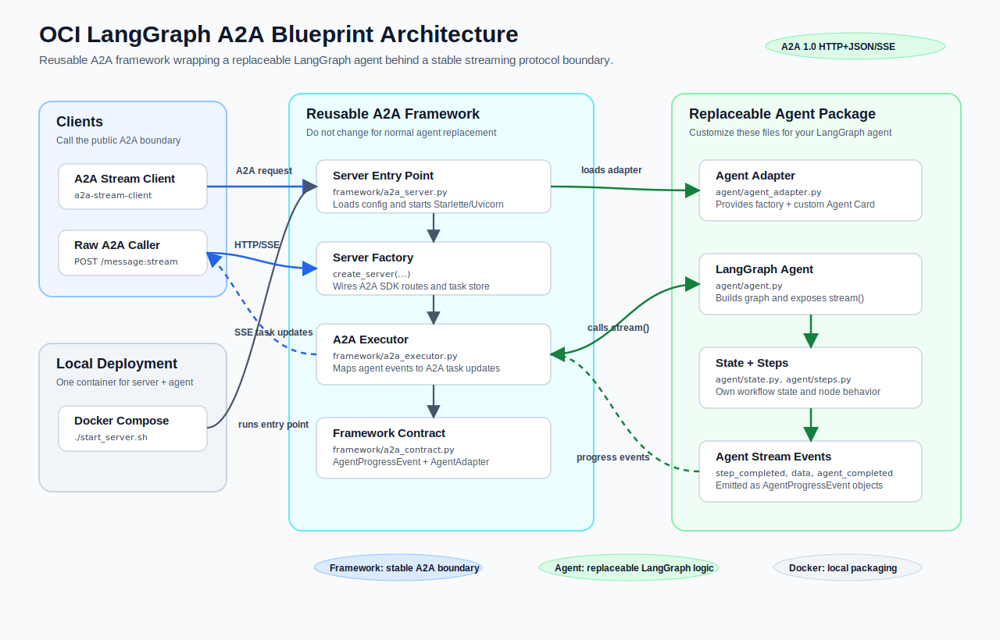

# OCI LangGraph A2A Blueprint


Build a production-oriented LangGraph agent, package it as an A2A-compatible server, and deploy it on Oracle Cloud Infrastructure.

This repository is a blueprint for teams that want to move from an agent prototype to a cloud-ready service with a clear protocol boundary. The goal is not only to run a LangGraph workflow, but to expose it through a standard A2A server interface so that other agents, applications, and orchestration layers can discover it, call it, and reason about its task lifecycle.

The blueprint currently connects the key pieces:

- a LangGraph agent with explicit state and replaceable workflow steps;
- an A2A-compatible HTTP/SSE API layer with Agent Card metadata, task handling, and streaming responses;
- A2A server runtime configuration that is centralized and easy to audit;
- local Python clients for direct agent execution and A2A streaming execution;
- a single-container Docker Compose deployment for local server validation;
- tests and specifications that make the behavior understandable, repeatable, and safe to evolve.

## Features

- Spec-driven development workflow with specifications under `specs/`.
- LangGraph agent with several steps (`step1`, `step2`, and `step3`) executed in sequence.
- Shared typed agent state with per-step outputs and final output.
- Each sample step implemented as a readable LangChain `Runnable`.
- LLM-backed `step2` using the OpenAI Responses API against an OCI OpenAI-compatible endpoint.
- Internal async streaming API for bare-agent progress events.
- Direct Python CLI client for invoking the sample agent without A2A.
- A2A `1.0` HTTP+JSON/REST server wrapper using the official A2A Python SDK.
- Public Agent Card discovery at `/.well-known/agent-card.json`.
- HTTP streaming endpoint at `POST /message:stream`.
- Server-Sent Events for task status updates, artifact updates, and completion.
- Injectable streaming agent factory for reusing the A2A server with another LangGraph agent.
- Centralized A2A server runtime configuration for host, port, public URL, and log level.
- Docker Compose deployment that runs the sample LangGraph agent and A2A server in one container.
- Python A2A streaming CLI client for testing the public protocol boundary.
- Unit tests for the sample agent, direct client, A2A server, A2A server configuration, and A2A streaming client.

## Current Implementation

The repository includes a sample LangGraph agent and an A2A HTTP/SSE wrapper.



The sample agent executes three sequential LangChain `Runnable` steps, shares
state across the graph, calls an LLM in `step2`, logs the start and completion
of each step, and exposes both synchronous invocation and asynchronous
streaming progress events.

```python
from oci_langgraph_a2a_blueprint import BareLangGraphAgent

agent = BareLangGraphAgent(step_sleep_seconds=0)
result = agent.invoke("hello")
print(result["final_output"])
```

The A2A server exposes:

- `GET /.well-known/agent-card.json`
- `POST /message:stream`

It intentionally focuses on the A2A 1.0 HTTP+JSON/REST streaming path with Server-Sent Events.
See [server/a2a/README.md](server/a2a/README.md) for detailed local run instructions.

## Quickstart

Start the local server:

```bash
conda activate oci-langgraph-a2a-blueprint
python -m pip install --no-deps -e .
cp env.sample .env
# Edit .env and set AGENT_LLM_API_KEY before starting the server.
AGENT_STEP_SLEEP_SECONDS=0 a2a-langgraph-server
```

In another terminal, call the server with the Python A2A streaming client:

```bash
conda activate oci-langgraph-a2a-blueprint
a2a-stream-client "hello"
```

Or send a raw streaming request:

```bash
curl -N \
  -H "Content-Type: application/a2a+json" \
  -H "A2A-Version: 1.0" \
  -d '{"message":{"messageId":"message-1","role":"ROLE_USER","parts":[{"text":"hello"}]},"configuration":{"acceptedOutputModes":["text/plain"]}}' \
  http://localhost:8080/message:stream
```

For direct in-process agent execution without A2A:

```bash
direct-agent-cli "hello" --sleep-seconds 0
```

The agent reads LLM settings from environment variables or from the ignored
local `.env` file:

```text
AGENT_LLM_MODEL_ID       Defaults to openai.gpt-5.5.
AGENT_LLM_API_KEY        Required OCI OpenAI-compatible API key.
AGENT_LLM_OCI_REGION     Defaults to us-chicago-1.
AGENT_LLM_BASE_URL       Optional explicit OpenAI-compatible endpoint.
```

## Docker Compose

Run the same A2A server in a single local container:

```bash
./start_server.sh
```

The composed server listens on `http://localhost:8080` by default. Stop it with:

```bash
./stop_server.sh
```

Set the simulated step duration with:

```bash
./start_server.sh --sleep-seconds 1.5
```

You can override the host port and advertised Agent Card URL:

```bash
A2A_SERVER_PORT=8123 \
A2A_SERVER_PUBLIC_URL=http://localhost:8123 \
./start_server.sh
```

## Documentation

- [docs/README.md](docs/README.md): documentation index.
- [docs/a2a-1-0-compliance.md](docs/a2a-1-0-compliance.md): A2A 1.0 compliance scope and limitations.
- [images/architecture-overview.svg](images/architecture-overview.svg): architecture overview diagram.
- [docs/custom-agent.md](docs/custom-agent.md): guide for plugging in your own LangGraph agent.
- [server/a2a/README.md](server/a2a/README.md): local A2A server usage and wrapper architecture.
- [clients/a2a-stream/README.md](clients/a2a-stream/README.md): A2A streaming client usage.
- [clients/direct-agent/README.md](clients/direct-agent/README.md): direct bare-agent client usage.
- [specs/](specs/): behaviour and architecture specifications.

The project follows a strict spec-driven development workflow. Every meaningful feature starts with a specification in `specs/`, and implementation must stay aligned with the approved behavior. This keeps the repository useful as both working code and a reference architecture for building interoperable agent services on OCI.
